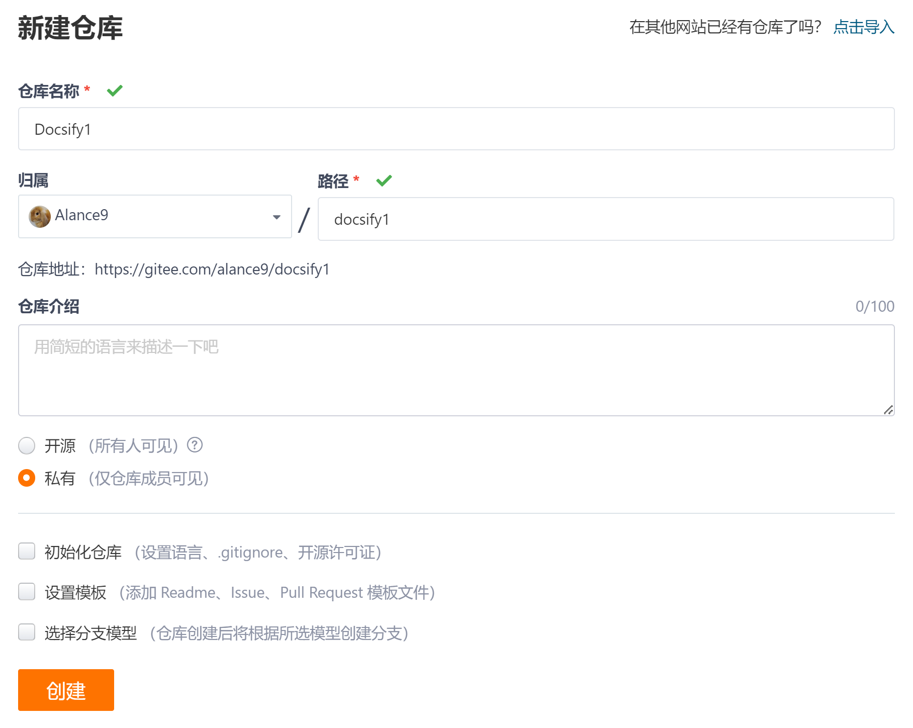
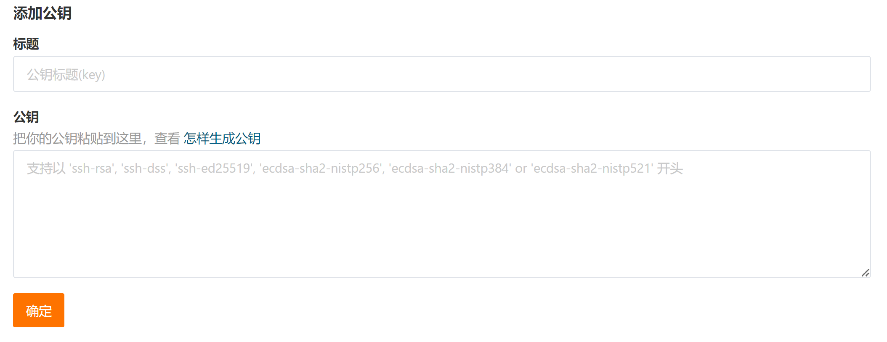

<!-- 远程部署 -->

> ### 1. 初始化项目

> #### Gitee 创建新仓库，无需勾选初始化

```
https://gitee.com/YOUR NAME/docsify.git
```



> #### 本地 git 全局设置
```
$ git config --global user.name "your gitee name"
$ git config --global user.email "your mail"
```

> #### 本地代码推送到远程空仓库

> 创建 .git 目录

    ```
    $ git init
    ```

> 连接远程仓库

    ```
    $ git remote add origin https://gitee.com/YOUR NAME/docsify.git
    修改 set-url
    删除 rm
    ```

> 查看当前远程仓库

    ```
    $ git remote -v
    ```

> 本地生成 ssh 密钥（Permission denied）

    ```
    $ ssh-keygen -t rsa -C "your mail"
    Your identification has been saved in c/Users/YOUR NAME/.ssh/id_rsa
    Your public key has been saved in c/Users/YOUR NAME/.ssh/id_rsa.pub
    C:\Users\YOUR NAME\.ssh (id_rsa. id_rsa.pub)
    ```

> 复制公钥存放到 SSH 公钥（ Gitee -账号设置）
    
    id_rsa.pub



> 查看 ssh 通信是否正常

    ```
    $ ssh -T git@gitee.com
    Hi YOUR NAME! You've successfully authenticated, but GITEE.COM does not provide shell access.
    ```

> 推送本地代码

    ```
    $ git push -u origin master
    ```

> 添加代码，提交，推送

    ```
    首次推送，远程仓库为空，报错：error: failed to push some refs to 'https://gitee.com/alance9/docsify.git'
    $ git add .
    $ git commit -m "first code"
    OR $ git commit -a  -m "first code" 
    $ git push -u origin master
    ```

> 转换报错，保持工作区都是纯 CRLF 即可

    ```
    warning: LF will be replaced by CRLF
    提交检出均不转换 CRLF. LF
    $ git config --global core.autocrlf false
    ```

> 缓存或网络问题

    ```
    fatal: the remote end hung up unexpectedly
    推送文件过大，修改提交缓存大小为500M 
    $ git config --global http.postBuffer 524288000
    ```

> 推送冲突

    ```
    remote: error: cannot lock ref 'refs/heads/master': reference already exists
    移除远程连接，再次连接推送
    $ git remote rm origin
    $ git remote add origin https://gitee.com/alance9/docsify.git
    ```

> ### 2. 远程部署


> Gitee Pages 部署网页
```
服务 - Gitee Pages （实名认证）
认证信息已经提交，工作人员会在 2 个工作日内审核，请耐心等待
```

?> 服务 - Gitee Pages，选择部署分支，启动


!> Failed to load resource: the server responded with a status of 404 (Not Found)

?> 部署后访问网址，页面处于 loading 中，F12 查看控制台，哪些组件引入使用了绝对路径导致报错，修改为相对路径
```
<!-- 绝对路径 -->
<link rel="stylesheet" href="/_plugins/vue.css">
<!-- 相对路径 -->
<link rel="stylesheet" href="./_plugins/vue.css">
```

> ### 3. 更新部署


> 更新代码，同步部署

```
代码更新推送后，点击更新，重新部署
点击关闭，关闭网址服务
```

