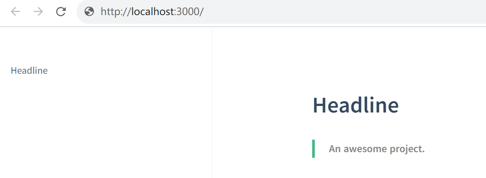

> ###  1、安装 Node.js 

Docsify 依赖于 node.js，下载安装：https://nodejs.org/en

```
环境变量
NODE_PATH ：D:\NodeJs\node_modules

用户变量
D:\NodeJs\node_global

安装完毕
C:\Users\Z>node -v
v18.17.0

C:\Users\Z>npm -v
9.6.7
```

> ### 2、安装 Docsify

勾选 NodeJs 安装目录下的所有权限（安全-完全控制），管理员身份运行 CMD，全局安装

```
npm i docsify-cli -g
```

> ### 3、初始化 docsify

初始化，创建 docs 目录及默认文件

- `index.html`    入口文件
- `README.md`     主页内容
- `.nojekyll`     阻止 GitHub Pages 忽略掉下划线开头的文件

```
docsify init docs

Initialization succeeded! Please run docsify serve docs
```

> ### 4、运行 docsify

`docsify serve ` 启动本地服务器

```
docsify serve docs

Serving C:\Users\Z\docs now.
Listening at http://localhost:3000
```

