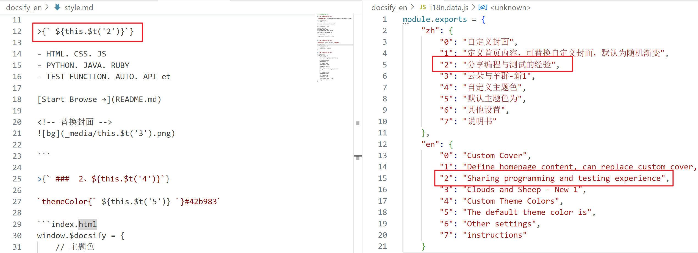

<!-- 本地化 -->

> ### 1. 文件本地化

**通过导航栏切换到英文侧边栏和文档**

> **新建本地化目录**

新建本地化目录，如英文本地化目录 docsify_en 

总目录下的首页. 侧边栏. 导航栏. README. 主要内容等 MD 文档，复制到本地化目录，进行翻译修改


> **本地化 MD 文件**

GT4T 翻译和修改文件，分享文件使用第三方翻译软件没问题，涉密文件不建议


> **通过项目的导航栏，切换到本地化侧边栏和对应文档**

设置路径分别跳转到总目录. 子目录的 README

?> 切换到子目录时，自动获取该目录下的子侧边栏 _sidebar，从而实现语言切换

```docsifyBlog/_navbar.md
<!-- 主导航栏 -->

* Language
  * [:uk: English](/docsify_en/README.md "English")
  * [:cn: 简体中文](/README.md "Chinese")

```

```docsifyBlog/docsify_en/_navbar.md
<!-- 子导航栏 -->

* Language
  * [:uk: English](/docsify_en/README.md "English")
  * [:cn: 简体中文](/README.md "Chinese")
```


> ### 2. 插件本地化

**通过全局变量切换到 $t() 函数定位的中英文语言包**

il8n 插件地址：https://github.com/woai3c/i18n-replace

il8n 不能单独为 Docsify 使用，需要 Vue + il8n 结合一起使用

> 安装 il8n 

`npm i -g i18n-replace`

> 百度翻译申请通用文本翻译
```    
https://fanyi-api.baidu.com/product/11
管理控制平台 - 开发者信息，获取 APPID. 密钥
每个月可以免费调用100万字符
```

> 拷贝修改 i18n.config.js

?> 修改 translation（开关）、 appid. key、 entry（翻译文件路径）、 to（翻译语言）、 mode（翻译模式）、 extra（文件格式）

默认支持 .vue 和 .js 文件的翻译，需要支持其他文件，如 extra: /(\.html)|(\.md)$/

``` js
// i18n.config.js

module.exports = {
    delay: 1500, // 自动翻译延时，必须大于 1000 ms，否则调用百度翻译 API 会失败
    mapFile: '', // 需要生成默认 map 的文件
    appid: '', // 百度翻译 appid
    key: '', // 百度翻译密钥
    output: 'i18n.data.js', // i18n 输出文件
    indent: 4, // i18n 输出文件缩进
    entry: '', // 要翻译的入口目录或文件，默认为命令行当前的 src 目录
    prefix: '', // i18n 变量前缀  i18n 变量生成规则 prefix + id + suffix
    suffix: '', // i18n 变量后缀
    id: 0, // i18n 自增变量 id
    translation: false, // 是否需要自动翻译中文
    to: 'en', // 中文翻译的目标语言
    mode: 1, // 0 翻译所有 i18n 数据，1 只翻译新数据
    loader: 'loader.js',
    pluginPrefix: '$t', // i18n 插件前缀 例如 vue-i18n: $t， react-i18next: t
    include: [], // 需要翻译的目录或文件
    exclude: [], // 不需要翻译的目录或文件 如果 exclude include 同时存在同样的目录或文件 则 exclude 优先级高
    extra: /(\.a)|(\.b)$/, // 默认支持 .vue 和 .js 文件 如果需要支持其他类型的文件，请用正则描述 例如这个示例额外支持 .a .b 文件
}
```

> 执行 i18n.config.js

执行命令 `rep`

```
E:\Code\docsifyBlog> rep
docsifyBlog 目录下生成已翻译的输出文件 i18n.data.js
```



> 后续结合 Vue 使用

```
创建 i18n 实例，挂载到 Vue 实例中，$t() 函数定位中英文取值
定义一个全局变量 locale，通过按钮 method 切换中英文（zh. en）
```
