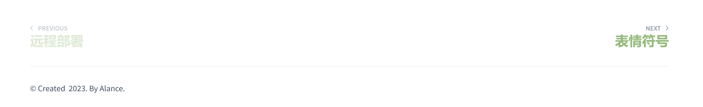

<!-- 常用插件 -->

> ### 1. search 搜索

具体见 [搜索栏](/docsify/search)

```index.html
script src="//cdn.jsdelivr.net/npm/docsify/lib/plugins/search.min.js"></script>
```

> ### 2. Copy 复制

代码栏提供复制功能 `Click to copy`

```index.html
<script src="//cdn.jsdelivr.net/npm/docsify-copy-code/dist/docsify-copy-code.min.js"></script>
```

> ### 3. Emoji 表情

具体见 [表情符号](/docsify/emo.md)

```index.html
<script src="//cdn.jsdelivr.net/npm/docsify/lib/plugins/emoji.min.js"></script>
```

> ### 4. 分页导航



```index.html
<script src="//cdn.jsdelivr.net/npm/docsify-pagination/dist/docsify-pagination.min.js"></script>
```

> ### 5. 脚注

```index.html
window.$docsify = {
    plugins: [
        function (hook) {
            var footer = [
            '<hr/>',
            '<footer>',
            '<span><a href=""></a> &copy; 2023. </span>',
            '<span> By Alance</a>.</span>',
            '</footer>'
            ].join('');

            hook.afterEach(function (html) {
            return html + footer;
            });
        }
    ]
}
```

> ### 6. 图片缩放

```index.html
<script src="//cdn.jsdelivr.net/npm/docsify/lib/plugins/zoom-image.min.js"></script>
```

> ### 7. 其他插件

具体见 [Docsify Plugins](https://docsify.js.org/#/awesome?id=plugins)