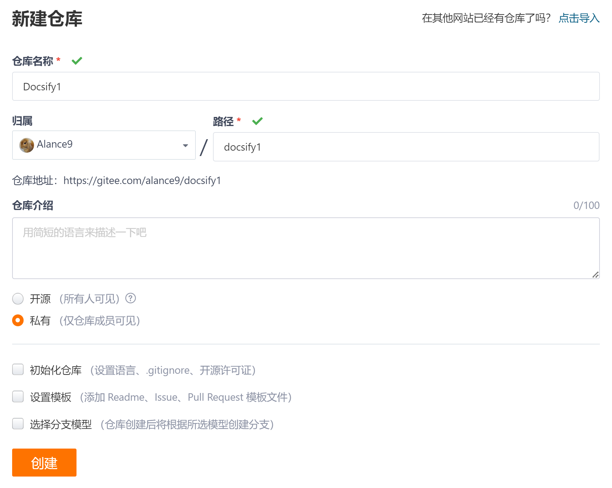
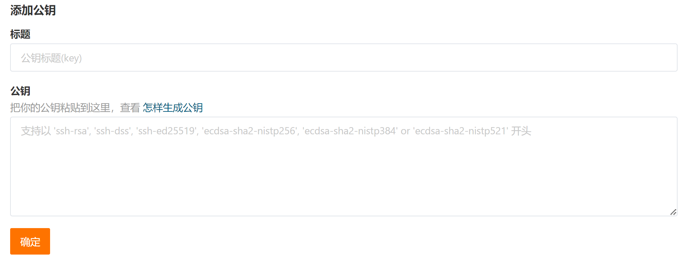

<!-- 远程部署 -->

> ### 1. Initialize the Project

> #### Gitee creates a new repository without checking Initialize


```
https://gitee.com/YOUR NAME/docsify.git
```



> #### Local git global settings

```
$ git config --global user.name "your gitee name"
$ git config --global user.email "your mail"
```

> #### Local code pushed to remote empty warehouse

> Create a .git directory


    ```
    $ git init
    ```

> Connect to the remote warehouse


    ```
    $ git remote add origin https://gitee.com/YOUR NAME/docsify.git
    revise set-url
    delete rm
    ```

> View the current remote warehouse


    ```
    $ git remote -v
    ```

> Locally generated SSH key (Permission denied)


    ```
    $ ssh-keygen -t rsa -C "your mail"
    Your identification has been saved in c/Users/YOUR NAME/.ssh/id_rsa
    Your public key has been saved in c/Users/YOUR NAME/.ssh/id_rsa.pub
    C:\Users\YOUR NAME\.ssh (id_rsa、id_rsa.pub)
    ```

> Copy the public key and save it to the SSH public key (Gitee-account settings)
    
    id_rsa.pub



> Check whether SSH communication is normal


    ```
    $ ssh -T git@gitee.com
    Hi YOUR NAME! You've successfully authenticated, but GITEE.COM does not provide shell access.
    ```

> Push local code


    ```
    $ git push -u origin master
    ```

> Add Code, Commit, Push


    ```
    When pushing for the first time, the remote warehouse is empty and an error is reported：
    error: failed to push some refs to 'https://gitee.com/alance9/docsify.git'
    $ git add .
    $ git commit -m "first code"
    OR $ git commit -a  -m "first code" 
    $ git push -u origin master
    ```

> The conversion reports an error, and it is enough to keep the work area pure CRLF


    ```
    warning: LF will be replaced by CRLF
    Submit check-out is not converted CRLF、LF
    $ git config --global core.autocrlf false
    ```

> Cache or network issue


    ```
    fatal: the remote end hung up unexpectedly
    The push file is too large, and the modification commit cache size is 500M 
    $ git config --global http.postBuffer 524288000
    ```

> Push conflict


    ```
    remote: error: cannot lock ref 'refs/heads/master': reference already exists
    Remove Remote Connection, Connect Push Again
    $ git remote rm origin
    $ git remote add origin https://gitee.com/alance9/docsify.git
    ```

> ### 2. Remote Deployment


> Gitee Pages Deployment Page

```
service - Gitee Pages （Real-name authentication）
The authentication information has been submitted, and the staff will review it within 2 working days. Please be patient and wait.
```

?> Service-Gitee Pages, select the deployment branch, start


!> Failed to load resource: the server responded with a status of 404 (Not Found)

?> After deployment, visit the URL. The page is in loading. F12 the console to see which components are introduced with absolute paths, resulting in an error. Change the path to a relative path.

```
<!-- Absolute path -->
<link rel="stylesheet" href="/_plugins/vue.css">
<!-- Relative path -->
<link rel="stylesheet" href="./_plugins/vue.css">
```

> ### 3. Update and Deploy


> Update code, deploy synchronously


```
After the code update is pushed, click Update to redeploy.
Click Close to close the URL service.
```

