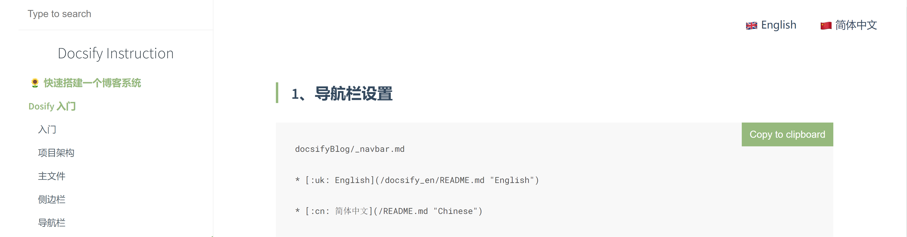
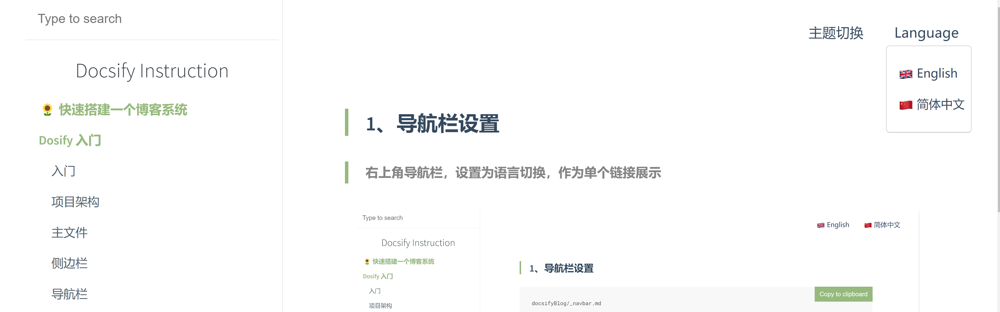

<!-- 导航栏 -->

> ### 1. Navigation Bar Settings


```index.html

window.$docsify = {
  // Load top navigation bar
  loadNavbar: true
}
```

> The navigation bar in the upper right corner is displayed as a single link



?> The default file name of the navigation bar is _navbar.md


```docsifyBlog/_navbar.md

* [:uk: English](/docsify_en/README.md "English")

* [:cn: 简体中文](/README.md "Chinese") 
```


> Displayed as a link to a drop-down box option




```docsifyBlog/_navbar.md 
* 主题切换
  * [:sunny: 黑夜](zh-cn/quickstart.md)
  * [:crescent_moon: 白天](zh-cn/quickstart.md)

* Language
  * [:uk: English](/docsify_en/ "English")
  * [:cn: 简体中文](/ "Chinese")
  ```

> ### 2. Multiple Navigation Bars

If there are multiple navigation bars, the main navigation bar is taken by default

If there is a sub-navigation bar, the sub-navigation bar will be taken, and if there is no sub-navigation bar, the main navigation bar will be taken

?> Implement language switching, see for details [Localizaction](/docsify/localize)


```docsifyBlog/_navbar.md
<!-- Main Navigation Bar -->

* Language
  * [:uk: English](/docsify_en/README.md "English")
  * [:cn: 简体中文](/README.md "Chinese")

```


```docsifyBlog/docsify_en/_navbar.md
<!-- Subnavigation Bar -->

* Language
  * [:uk: English](/docsify_en/README.md "English")
  * [:cn: 简体中文](/README.md "Chinese")
```