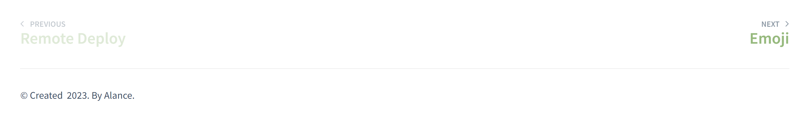

<!-- 常用插件 -->

> ### 1. search

See specifically [Search](/docsify/search)


```index.html
script src="//cdn.jsdelivr.net/npm/docsify/lib/plugins/search.min.js"></script>
```

> ### 2. Copy

The code bar provides a copy function `Click to copy`


```index.html
<script src="//cdn.jsdelivr.net/npm/docsify-copy-code/dist/docsify-copy-code.min.js"></script>
```

> ### 3. Emojis

See specifically [Emojis](/docsify/emo.md)


```index.html
<script src="//cdn.jsdelivr.net/npm/docsify/lib/plugins/emoji.min.js"></script>
```

> ### 4. Paginated Navigation



```index.html
<script src="//cdn.jsdelivr.net/npm/docsify-pagination/dist/docsify-pagination.min.js"></script>
```

> ### 5. Footnote


```index.html
window.$docsify = {
    plugins: [
        function (hook) {
            var footer = [
            '<hr/>',
            '<footer>',
            '<span><a href=""></a> &copy; 2023. </span>',
            '<span> By Alance</a>.</span>',
            '</footer>'
            ].join('');

            hook.afterEach(function (html) {
            return html + footer;
            });
        }
    ]
}
```

> ### 6. Image Scaling

```index.html
<script src="//cdn.jsdelivr.net/npm/docsify/lib/plugins/zoom-image.min.js"></script>
```

> ### 7. Nighttime Theme Switching

```index.html
<link rel="stylesheet" href="//cdn.jsdelivr.net/npm/docsify-darklight-theme@latest/dist/style.min.css">
<script src="//cdn.jsdelivr.net/npm/docsify-darklight-theme@latest/dist/index.min.js"></script>
```
Replace icons through a free material library

Ali free icons：https://www.iconfont.cn/


> ### 8. Other Plugins

See specifically [Docsify Plugins](https://docsify.js.org/#/awesome?id=plugins)